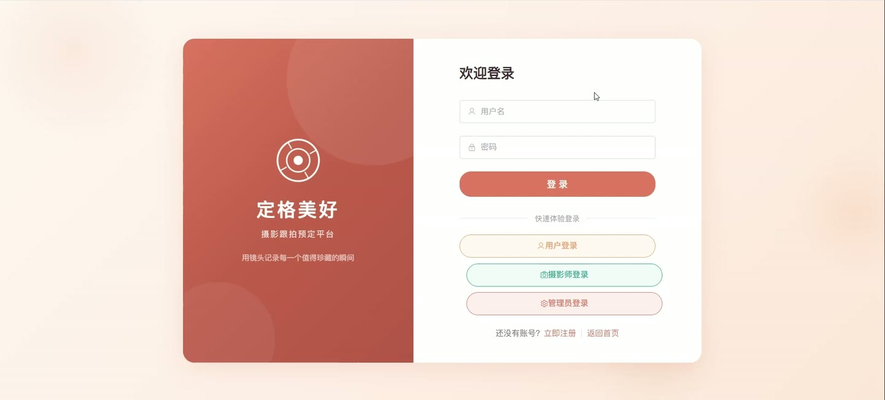
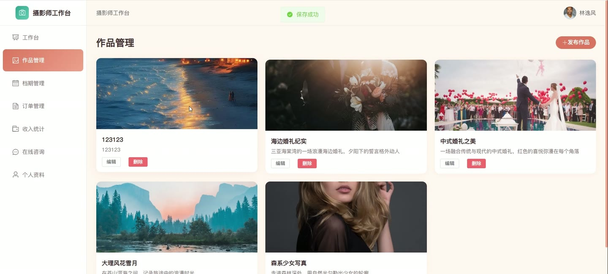

# (附文档)Springboot3+Vue3+MySQL 摄影跟拍预定平台

**技术栈**：Springboot3、Vue3、MySQL

### 系统简介

本系统是一个基于 Spring Boot 3 + Vue 3 + MySQL 的摄影跟拍预定平台，采用前后端分离架构。系统包含普通用户端、摄影师端和管理员端三个角色，支持用户浏览作品与摄影师、在线预约下单、即时通讯、社区互动，摄影师可管理档期、作品与收入，管理员可审核摄影师、管理订单与内容。
 
### 核心功能
 
### 普通用户端

 
- 浏览首页轮播图、服务分类、热门作品及推荐摄影师 
- 查看作品列表（支持按分类/关键词筛选）及作品详情（含摄影师信息与分类名称） 
- 查看摄影师列表（支持按关键词/所在地筛选）及摄影师详情（含作品、档期、评价） 
- 查看摄影师可预约档期（日期+时段）及已预约日期时段 
- 创建预约订单：选择摄影师、服务分类、拍摄日期/时段，系统自动校验档期可用性并生成订单号 
- 查看我的订单列表（支持按状态筛选）及订单详情（含摄影师信息、服务分类、评价） 
- 对订单进行支付操作（模拟支付，更新支付状态） 
- 取消订单（释放已占用的档期，已支付订单标记为退款） 
- 对已完成订单提交评价（含评分与内容，每个订单仅可评价一次） 
- 对订单发起纠纷申诉（填写申诉原因，订单状态变为纠纷中） 
- 查看个人资料并修改昵称、头像、手机、邮箱及密码 
- 在社区发布帖子（需审核后可见），浏览社区帖子列表及详情 
- 对社区帖子发表评论（支持回复他人评论） 
- 与摄影师或管理员进行即时聊天（查看会话列表、发送文字消息、标记已读） 
- 查看系统通知列表（含未读数量），标记单条或全部通知为已读
 
### 摄影师端

 
- 查看个人工作台仪表盘（总订单数、待处理订单、作品数、总收入、最近订单） 
- 查看并编辑个人资料（简介、专长、从业年限、基础价格、所在地） 
- 管理我的作品：新增/编辑/删除作品（标题、描述、封面、图片、分类） 
- 管理档期：添加可用档期（日期+时段），删除未预约的档期 
- 查看我的订单列表（支持按状态筛选），查看订单关联的用户信息与服务分类 
- 更新订单状态：确认订单、开始拍摄、后期制作、完成交付（可上传交付链接） 
- 查看收入统计（总收入、已完成收入、已提现金额、可提现金额） 
- 申请提现（填写提现金额，系统自动校验可提现余额） 
- 查看提现记录列表
 
### 管理员端

 
- 查看系统仪表盘（用户数、摄影师数、订单数、作品数、总收入、待审核数） 
- 查看订单状态分布（待确认/已确认/拍摄中/已完成/已取消）及分类统计 
- 管理用户：查看用户列表（支持按角色/关键词搜索），启用或禁用用户账号 
- 管理摄影师：查看摄影师资料列表（支持按审核状态筛选），审核通过或驳回摄影师入驻申请 
- 管理服务分类：新增/编辑/删除分类（名称、描述、封面、基础价格、排序、状态） 
- 管理订单：查看全部订单列表（支持按状态筛选），手动修改订单状态 
- 内容审核：查看待审核的社区帖子与作品，审核通过或驳回 
- 管理轮播图：新增/编辑/删除轮播图（标题、图片、链接、排序、状态） 
- 查看并处理摄影师提现申请（审核通过/拒绝） 
- 查看并处理用户发起的纠纷申诉（调解处理）
 
### 技术栈

 后端框架Spring Boot 3 ORMMyBatis-Plus 权限认证JWT（jjwt） 前端框架Vue 3 状态管理Pinia 构建工具Vite 数据库MySQL 文件上传本地文件存储（MultipartFile）
 
### 交付内容

 
- 后端完整源码 
- 前端完整源码 
- 数据库初始化脚本 
- 万字文档

## 界面展示

---

## 获取完整源码 + 万字文档

本仓库为项目介绍页。**完整前后端源码、数据库初始化脚本、万字项目文档**，请加微信 `kangkangcode`，或访问 [codekk.top](http://codekk.top) 获取。

可作课程设计 / 毕业设计参考，支持远程部署调试。